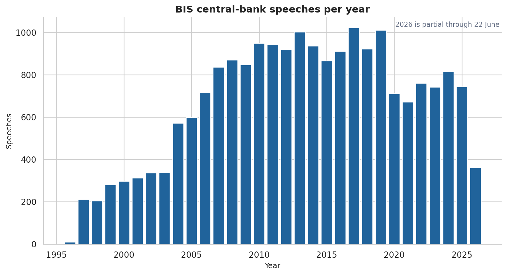
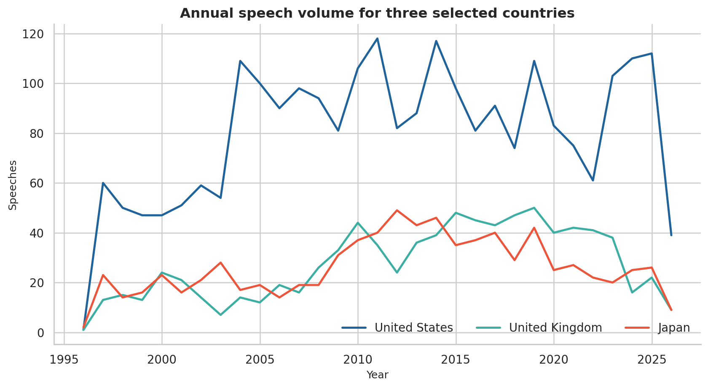
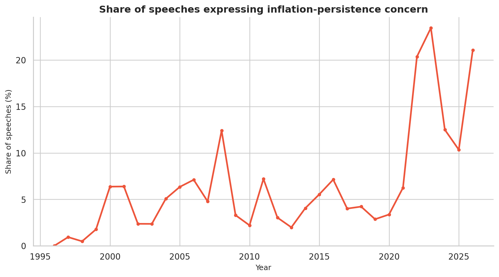
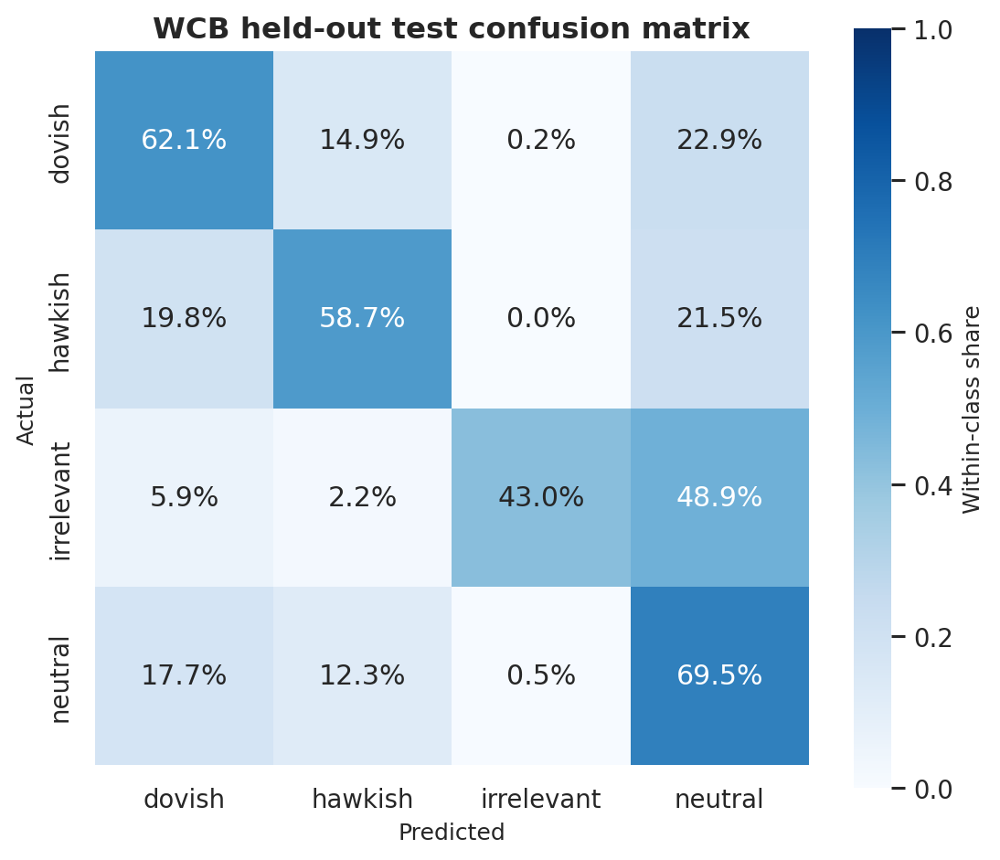
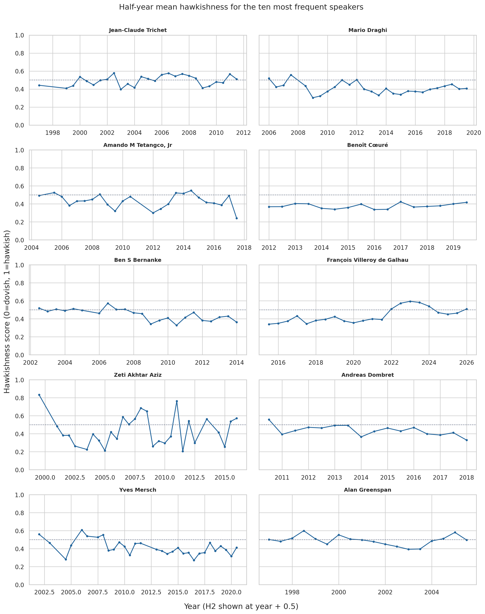
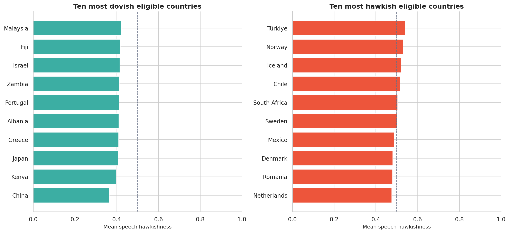
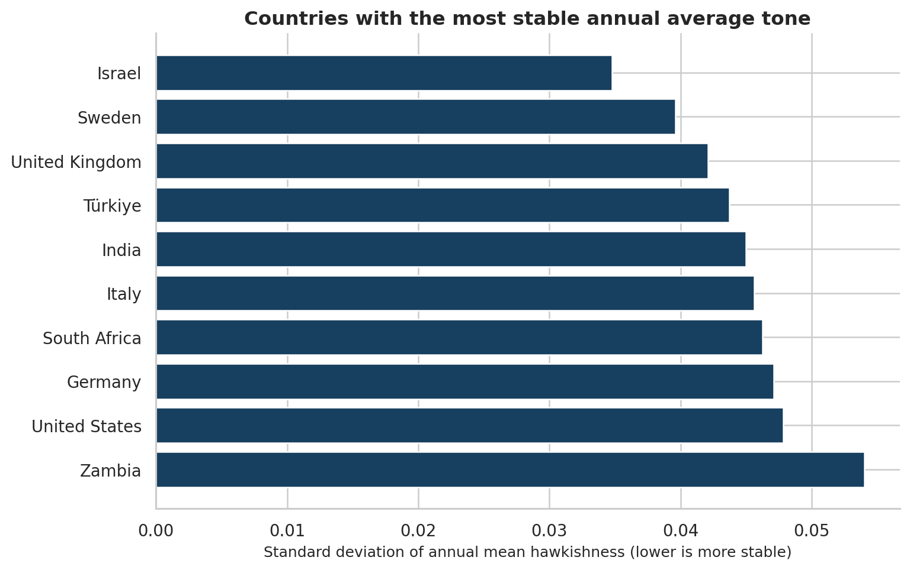

# Central-Bank Speech Communication: BIS Archive Analysis

## Executive summary

This analysis covers **20,728 speeches from 1996-09-10 through 2026-06-22**. Inflation-persistence language appears in **1,404 speeches (6.8%)** and rose sharply in 2022–23, peaking at **23.5% in 2023**. A calibrated, supervised sentence classifier reaches **63.0% test accuracy** and **0.616 macro-F1** on the external World Central Banks (WCB) held-out test split; its country and speaker results should therefore be interpreted as structured descriptive estimates, not ground truth.

## 1. Basic data exploration

The script loads the assignment-required relative path `./BIS_speeches.csv`, collapses whitespace in `date`, `author`, `title`, `description`, and `text`, parses dates, and retains all substantive records. Two archive records carried impossible 2027 years; their years were minimally corrected to 2025 and 2026 after checking the BIS URL identifiers and live pages, and the original values remain in `date_raw`.

| Measure | Result |
| --- | --- |
| Speeches | 20,728 |
| Coverage | 1996-09-10 to 2026-06-22 |
| Unique named speakers | 1,019 |
| Inflation mentioned | 11,489 (55.4%) |

Speech length is the number of whitespace-delimited tokens after whitespace normalization.

| Statistic | Words |
| --- | --- |
| Minimum | 38.0 |
| Maximum | 48,830.0 |
| Mean | 2,803.9 |
| Median | 2,447.5 |
| Standard Deviation | 1,871.8 |

The additional economically motivated statistic is the share of speeches that mention inflation: **11,489 (55.4%)**. Inflation is central to most central-bank price-stability mandates, so this gives a simple measure of how much of the archive directly engages with a core monetary-policy objective.



One important limitation is selection and measurement error: BIS describes this as an archive of central-bank speeches, not a census, and warns that completeness and machine-extracted text quality are not guaranteed. The archive also over-represents institutions that publish frequently in English or are more consistently collected; 2026 is only a partial year through 22 June.

## 2. Country attribution via metadata

Country is defined as the jurisdiction represented by the speaker's institution at the speech date—not the speaker's nationality, event location, host institution, or a country merely discussed. The resolver:

1. normalizes and searches only the leading byline/affiliation window of `description` (falling back to the opening text when needed);
2. applies a curated, longest-specificity institution alias registry, while scoring explicit roles such as “Governor of” above honorees or hosts;
3. assigns a conservative author-level fallback only when at least three directly mapped speeches agree at least 95%; and
4. retains the method, matched alias, conflict candidates, regional/supranational category, and unresolved queue for audit.

This resolves **20,528 directly**, **168 by conservative speaker fallback**, and leaves **32 unresolved**, for **99.8% total coverage**. It also flags **579** bylines containing aliases from multiple jurisdictions for QA. The rankings below include only national jurisdictions; the ECB, BIS, and regional currency unions are preserved separately rather than forced into a headquarters country.

| Rank | Country | Speeches | Speakers |
| --- | --- | --- | --- |
| 1 | United States | 2,488 | 71 |
| 2 | India | 1,010 | 44 |
| 3 | Germany | 936 | 34 |
| 4 | United Kingdom | 847 | 49 |
| 5 | Japan | 814 | 48 |
| 6 | Canada | 612 | 29 |
| 7 | Australia | 589 | 18 |
| 8 | Malaysia | 583 | 30 |
| 9 | Philippines | 569 | 8 |
| 10 | Sweden | 520 | 25 |



The main attribution challenge is that descriptions can mention several institutions—for example, a national governor who also holds a BIS role, or an ECB speaker hosted by another central bank. Restricting matching to the byline, using role-aware ordering, preserving multi-match flags, and never inferring from venue materially reduces that error, but the mapping is still estimated metadata rather than a BIS-supplied country field.

## 3. Inflation-persistence keyword signal

The high-precision indicator uses six transparent pattern families: persistent/sticky inflation; inflation that remains high/elevated/above target; inflation expected to remain high; continuing price or cost pressures; inflation lasting longer than expected; and second-round effects or de-anchored expectations. A speech is flagged when at least one expression appears; the exact regular expressions are in `outputs/tables/inflation_persistence_patterns.csv`.

**Result:** 1,404 speeches (6.8%) are flagged.

| Year | All speeches | Flagged | Share |
| --- | --- | --- | --- |
| 2019 | 1011 | 29 | 2.9% |
| 2020 | 711 | 24 | 3.4% |
| 2021 | 672 | 42 | 6.2% |
| 2022 | 761 | 155 | 20.4% |
| 2023 | 742 | 174 | 23.5% |
| 2024 | 816 | 102 | 12.5% |
| 2025 | 744 | 77 | 10.3% |
| 2026 | 361 | 76 | 21.1% |



The series accelerates from **6.2% in 2021** to **20.4% in 2022** and **23.5% in 2023**, then retreats to **12.5% in 2024** and **10.3% in 2025**. The 2026 value is elevated but is partial and should not be compared mechanically with full years. Keyword rules are auditable, but they can miss paraphrases and may misread negation, quotation, historical discussion, or a risk scenario as the speaker's own current concern.

## 4. Speech-level hawkishness and dovishness

### Learning paradigm and features

The tone model is supervised multiclass sentence classification. It trains on the public [World Central Banks annotated dataset](https://huggingface.co/datasets/gtfintechlab/all_annotated_sentences_25000), whose stance labels are `hawkish`, `dovish`, `neutral`, and `irrelevant`, using the official 17,500/3,750/3,750 train/validation/test split. The model combines 1–2 word TF-IDF features and 3–5 character TF-IDF features in a class-balanced, averaged logistic-loss SGD classifier. Hyperparameter `alpha` is chosen on validation macro-F1 and probabilities are sigmoid-calibrated on the validation split; the test set is touched once for final reporting. The design is a lightweight, reproducible alternative to the larger WCB RoBERTa model described in the [WCB paper](https://arxiv.org/abs/2505.17048) and [official repository](https://github.com/gtfintechlab/WorldCentralBanks).

Each BIS speech is split into sentences and then at contrast markers such as “but,” “however,” and semicolons. Only policy-relevant clauses are scored. Let `H` and `D` be the summed calibrated hawkish and dovish probabilities across a speech:

- hawkishness = `H / (H + D)`, on 0 (dovish) to 1 (hawkish);
- mixedness = `1 - |H - D| / (H + D)`, where 1 means balanced directional evidence; and
- signal strength = `(H + D) / number of clauses`.

This permits one speech to contain tightening and easing scenarios. Speeches with no policy clause or signal strength below 0.15 receive an `insufficient_signal` flag and are excluded from aggregates; **16,803 speeches (81.1%)** remain tone-valid.

### Validation

- Best validation `alpha`: **0.0001**
- Held-out accuracy: **0.630**
- Held-out macro-F1: **0.616**
- Held-out weighted-F1: **0.628**
- Held-out log loss: **0.894**
- Multiclass Brier score: **0.504**
- 15-bin top-label expected calibration error: **0.029**

| Class | Precision | Recall | F1 | Support |
| --- | --- | --- | --- | --- |
| dovish | 0.634 | 0.621 | 0.627 | 1252 |
| hawkish | 0.644 | 0.587 | 0.614 | 1074 |
| irrelevant | 0.879 | 0.430 | 0.577 | 135 |
| neutral | 0.605 | 0.695 | 0.647 | 1289 |



### Concrete classifications

- **Hawkish:** “persistently elevated inflation expectations and their further increase pose a significant risk.” The model assigns `p(hawkish)=0.950`. Persistently elevated and rising inflation expectations are framed as a risk, which supports tighter policy.
- **Dovish:** “2) the annual average of headline inflation was projected to be below the lower bound of the inflation target due to (1) energy prices declining at a fast pace and (2) core inflation being lowest in nine years and projected to slow down in line with subdued demand-pull inflationary pressures.” The model assigns `p(dovish)=0.916`. Below-target projected inflation, falling energy prices, low core inflation, and subdued demand support accommodation.

## 5. Speaker-level tone over time

The top ten speakers are selected by total archive frequency. Speech scores are averaged in half-year windows: this reduces speech-level noise while preserving more timing information than annual averages. Each speech receives equal weight, so unusually long speeches do not dominate.

| Rank | Speaker | All speeches | Tone-valid | Mean score | Mixedness |
| --- | --- | --- | --- | --- | --- |
| 1 | Jean-Claude Trichet | 478 | 454 | 0.507 | 0.798 |
| 2 | Mario Draghi | 337 | 318 | 0.396 | 0.760 |
| 3 | Amando M Tetangco, Jr | 272 | 177 | 0.441 | 0.754 |
| 4 | Benoît Cœuré | 254 | 235 | 0.377 | 0.724 |
| 5 | Ben S Bernanke | 252 | 218 | 0.441 | 0.770 |
| 6 | François Villeroy de Galhau | 228 | 191 | 0.442 | 0.774 |
| 7 | Zeti Akhtar Aziz | 224 | 80 | 0.421 | 0.605 |
| 8 | Andreas Dombret | 222 | 166 | 0.427 | 0.721 |
| 9 | Yves Mersch | 194 | 168 | 0.389 | 0.734 |
| 10 | Alan Greenspan | 192 | 161 | 0.497 | 0.802 |



For each speaker, an OLS trend is fitted to half-year means. Reported standard errors are heteroskedasticity- and autocorrelation-consistent (HAC, two half-year lags); Benjamini–Hochberg correction controls the false-discovery rate across ten tests.

| Speaker | Half-years | Slope/year | HAC t | p | BH q | q < .05 |
| --- | --- | --- | --- | --- | --- | --- |
| Jean-Claude Trichet | 27 | +0.0040 | 1.53 | 0.1253 | 0.2506 | No |
| Mario Draghi | 27 | -0.0043 | -1.36 | 0.1746 | 0.2910 | No |
| Amando M Tetangco, Jr | 24 | -0.0042 | -1.11 | 0.2681 | 0.3352 | No |
| Benoît Cœuré | 16 | +0.0029 | 1.14 | 0.2525 | 0.3352 | No |
| Ben S Bernanke | 23 | -0.0129 | -7.27 | <0.0001 | <0.0001 | Yes |
| François Villeroy de Galhau | 22 | +0.0180 | 4.24 | <0.0001 | 0.0001 | Yes |
| Zeti Akhtar Aziz | 29 | +0.0006 | 0.08 | 0.9324 | 0.9324 | No |
| Andreas Dombret | 16 | -0.0138 | -3.26 | 0.0011 | 0.0038 | Yes |
| Yves Mersch | 31 | -0.0079 | -2.86 | 0.0042 | 0.0106 | Yes |
| Alan Greenspan | 18 | -0.0045 | -0.76 | 0.4494 | 0.4993 | No |

Four trends remain statistically distinguishable from zero at 5% FDR: **Ben S Bernanke (-0.0129/year, q=<0.0001); François Villeroy de Galhau (+0.0180/year, q=0.0001); Andreas Dombret (-0.0138/year, q=0.0038); Yves Mersch (-0.0079/year, q=0.0106)**. These estimates describe within-speaker archival trends, not causal changes in preferences; changing economic regimes, topic mix, job roles, and sample coverage can all move the measured score.

## 6. Country-level tone and stability

Country means give equal weight to each tone-valid speech. To limit thin-sample rankings, a country must have at least **50 tone-valid speeches across at least 10 observed years**. The stability ranking uses the standard deviation of annual mean tone, requires at least three speeches in each annual cell and at least ten qualifying years, and is therefore a comparison of temporal dispersion rather than the precision of the overall mean. Mean-score uncertainty is shown with a seeded, speech-level nonparametric bootstrap.

The “hawkish” and “dovish” lists are **relative rankings within the eligible sample**. A country can be among the ten most hawkish even when its mean is below the neutral midpoint of 0.5.

### Relatively most hawkish

| Rank | Country | Primary archive institution | Speeches | Mean score | 95% bootstrap CI |
| --- | --- | --- | --- | --- | --- |
| 1 | Türkiye | Central Bank of the Republic of Turkey | 106 | 0.539 | [0.522, 0.558] |
| 2 | Norway | Norges Bank | 301 | 0.530 | [0.518, 0.542] |
| 3 | Iceland | Central Bank of Iceland | 92 | 0.521 | [0.500, 0.538] |
| 4 | Chile | Central Bank of Chile | 146 | 0.515 | [0.499, 0.531] |
| 5 | South Africa | South African Reserve Bank | 397 | 0.505 | [0.494, 0.516] |
| 6 | Sweden | Sveriges Riksbank | 495 | 0.503 | [0.494, 0.512] |
| 7 | Mexico | Bank of Mexico | 89 | 0.487 | [0.462, 0.510] |
| 8 | Denmark | National Bank of Denmark | 104 | 0.481 | [0.453, 0.508] |
| 9 | Romania | National Bank of Romania | 56 | 0.480 | [0.445, 0.511] |
| 10 | Netherlands | Netherlands Bank | 175 | 0.476 | [0.452, 0.501] |

### Relatively most dovish

| Rank | Country | Primary archive institution | Speeches | Mean score | 95% bootstrap CI |
| --- | --- | --- | --- | --- | --- |
| 1 | China | People's Bank of China | 103 | 0.364 | [0.333, 0.395] |
| 2 | Kenya | Central Bank of Kenya | 76 | 0.396 | [0.351, 0.440] |
| 3 | Japan | Bank of Japan | 780 | 0.406 | [0.397, 0.415] |
| 4 | Greece | Bank of Greece | 169 | 0.409 | [0.387, 0.431] |
| 5 | Albania | Bank of Albania | 266 | 0.411 | [0.395, 0.427] |
| 6 | Portugal | Bank of Portugal | 67 | 0.411 | [0.380, 0.443] |
| 7 | Zambia | Bank of Zambia | 102 | 0.412 | [0.380, 0.445] |
| 8 | Israel | Bank of Israel | 92 | 0.415 | [0.392, 0.439] |
| 9 | Fiji | Reserve Bank of Fiji | 78 | 0.417 | [0.378, 0.459] |
| 10 | Malaysia | Central Bank of Malaysia | 206 | 0.422 | [0.396, 0.449] |



### Most stable annual average tone

| Rank | Country | Primary archive institution | Speeches | Qualifying years | Mean score | Annual SD |
| --- | --- | --- | --- | --- | --- | --- |
| 1 | Israel | Bank of Israel | 92 | 13 | 0.415 | 0.035 |
| 2 | Sweden | Sveriges Riksbank | 495 | 30 | 0.503 | 0.040 |
| 3 | United Kingdom | Bank of England | 751 | 30 | 0.463 | 0.042 |
| 4 | Türkiye | Central Bank of the Republic of Turkey | 106 | 16 | 0.539 | 0.044 |
| 5 | India | Reserve Bank of India | 811 | 30 | 0.449 | 0.045 |
| 6 | Italy | Bank of Italy | 384 | 26 | 0.441 | 0.046 |
| 7 | South Africa | South African Reserve Bank | 397 | 29 | 0.505 | 0.046 |
| 8 | Germany | Deutsche Bundesbank | 779 | 30 | 0.454 | 0.047 |
| 9 | United States | Board of Governors of the Federal Reserve System | 2061 | 30 | 0.458 | 0.048 |
| 10 | Zambia | Bank of Zambia | 102 | 10 | 0.412 | 0.054 |



## 7. Assumptions, limitations, and interpretation

- **Trend tests:** OLS assumes a linear mean trend and comparable scores over time. HAC inference relaxes independent, homoskedastic residuals but does not remove omitted-variable bias; BH correction addresses multiple testing, not model misspecification.
- **Country rankings:** speeches are not random samples of all central-bank communication. Bootstrap intervals quantify within-archive sampling variability, not corpus selection bias, model error, or country-attribution uncertainty.
- **Model transfer:** WCB labels span multiple central banks but remain sentence annotations that may differ from BIS speech prose, historical vocabulary, and translated English. Held-out macro-F1 of 0.616 is useful but leaves substantial classification error.
- **Mixed content:** a score near 0.5 can mean genuinely neutral language or offsetting hawkish and dovish statements. `tone_mixedness` and `tone_signal_strength` must be read with the main score.
- **Licensing:** the external WCB dataset is published under a noncommercial share-alike license on its dataset card; this repository downloads but does not redistribute it. Confirm licensing before commercial reuse.

## 8. Reproducibility

From the repository root:

```bash
python -m venv .venv
source .venv/bin/activate
pip install -r requirements.txt
python scripts/download_data.py
python scripts/download_wcb_data.py
python run_analysis.py
python scripts/build_report.py
python scripts/build_notebook.py
pytest
python scripts/validate_outputs.py
```

The raw BIS archive and WCB parquet files are hash-pinned but excluded from Git. Small result tables, figures, the executed notebook, and this report are retained for inspection.

## References

- [BIS central-bank speech archive and download notes](https://www.bis.org/speeches/central-bank/download)
- [World Central Banks paper](https://arxiv.org/abs/2505.17048)
- [WCB dataset card](https://huggingface.co/datasets/gtfintechlab/all_annotated_sentences_25000)
- [WCB model card](https://huggingface.co/gtfintechlab/model_WCB_stance_label)
- [WorldCentralBanks official code repository](https://github.com/gtfintechlab/WorldCentralBanks)
